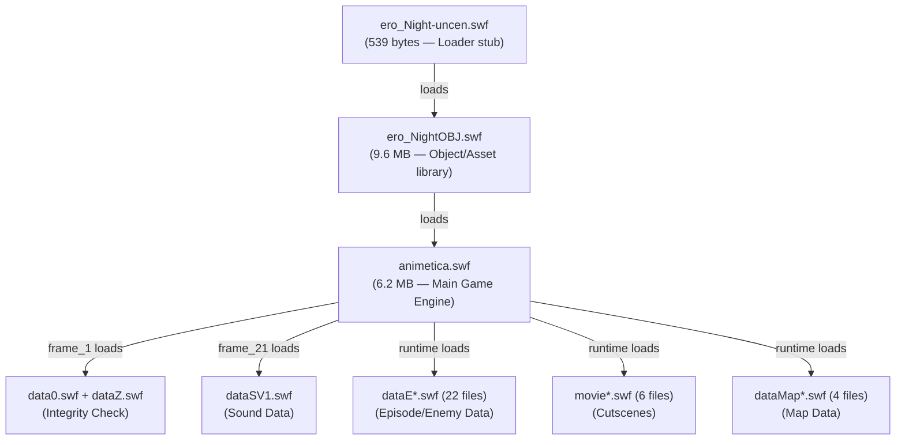

# SWF Files — Decompiled Logic Analysis

All 41 SWF files are **uncompressed Flash 9 (ActionScript 2)**.  
Decompiled using **FFDEC v25.1.3** CLI. Exported scripts saved to `_exported/` folder.

---

## Architecture Overview



---

## File-by-File Breakdown

### 1. `ero_Night-uncen.swf` — Loader Stub (539 bytes, 1 script)

Simply creates a `MovieClipLoader` and loads `ero_NightOBJ.swf`:

```actionscript
var ero = new MovieClipLoader();
ero.loadClip("./ero_NightOBJ.swf", objMC);
```

### 2. `data0.swf` / `dataZ.swf` — Integrity Check (~6 KB each, 1 script each)

Tiny config files used for **integrity validation**:

```actionscript
ero = 5963;   // data0.swf
flg = false;  // trial version flag (TAIKEN)
```

Frame_18 of `animetica.swf` checks that `data0.ero == dataZ.ero` to verify files aren't corrupted/mismatched.

### 3. `animetica.swf` — Main Game Engine (6.2 MB, 112 scripts)

This is the **core of the application**. Key logic organized by frame:

| Frame | Function | Description |
|---|---|---|
| **1** | Initialization | Sets `Stage.scaleMode`, disables right-click menu items, sets `baseUrl`, loads `data0.swf` + `dataZ.swf` |
| **2-4** | Preloader | Loading bar loop — checks `getBytesLoaded()` vs `getBytesTotal()` |
| **18** | Integrity Check | Validates `data0.ero == dataZ.ero`; sets `TAIKEN` (trial) flag; blocks if mismatch |
| **20** | FPS Counter | `setInterval` at 1000ms for frame rate monitoring |
| **21** | Sound Loader | Loads `dataSV1.swf` (sound data) via `MovieClipLoader` |
| **22** | **Save/Load System** | Uses `SharedObject.getLocal("erotica1")` — saves/loads: map position, gold, player name, equipment, battle stats, event flags (`SBCflg[]` array) |
| **23** | **Game Data Definitions** | Massive frame (2095 lines) defining: `BattleTextDataSet()`, `textDataSet()` (540+ NPC dialog entries), `itemSet()` (100+ items with names/stats/prices), `enemyIntelSet()` (enemy data) |
| **25** | **Battle System** | Core combat engine (2305 lines): `BFsysProcessing()`, turn-based battle loop, `battlePriPro()` (player turn), `battleEnePro()` (enemy turn), `princeAttack()`, `commandSet()`, damage/defense calculations |
| **27** | **Animation System** | `animeticaPro()` — pattern-based animation controller using character codes (ASCII), `nextCode()`, `animeStartPro()`, animation state machine |

#### Save/Load System (frame_22)
```actionscript
function saveProcessing() {
    var so = SharedObject.getLocal("erotica1", "/");
    so.data.data0 = mapX;      // map X position
    so.data.data1 = mapY;      // map Y position
    so.data.data2 = mapNo;     // current map number
    so.data.data3 = gold;      // currency
    so.data.data4 = cName;     // character name
    so.data.data5 = watt;      // battery/energy
    so.data.data10 = itemTimes; // item usage count
    so.data.data15 = tTime;    // total play time
    so.data.data16 = tBattleCo; // battle count
    so.data.data20 = TEflg;    // event flags
    // ... 20+ SBCflg[] story completion flags
    so.flush();
}
```

#### Battle System (frame_25)
- **Turn-based**: `BFturn % 2 == 0` = enemy turn, `BFturn % 2 == 1` = player turn
- **Player commands**: Strip (脱がす), Touch attack, Kiss, Insert, Item-based attack, Defense, Escape
- **Damage calculation**: `damageCalculate()` factors in weapon level (`BFweponLv`), equipped items, buff states
- **Item buffs**: Items have `sustinMax` (duration in turns), `atk`/`def` modifiers
- **Enemy state**: Tracks clothing flags (`partsFlg0-12`), excitement level

#### Item System (frame_23 — `itemSet()`)
100+ items defined with properties: `iName`, `atk`, `def`, `buy` price, `useFlg`, `BUflg`, `sustinMax`, `comment`

| Category | Examples |
|---|---|
| Consumables | Energy water, Cool gel, Guardian angel's tear |
| Supplements | Supplement A/S/KING (ectPmax boost) |
| Attack items | Perfumes, Oils, Lotions, Sprays |
| Equipment | Rotors, Rings, Incense, Candles |
| Key items | Mountain bell, Royal family crest, Thunder wand, Crestone |

#### NPC Dialog System (frame_23 — `textDataSet()`)
540+ dialog entries (`TD[]` array) covering the entire game narrative:
- Village NPCs, shopkeepers, quest givers
- Major characters: Aya, Fourd (prince), Mercedes (master), Dr.Crysler, Roof, Queen
- Bosses: Sailor Mermaid, Ghoul Beauty, Gunghoul, Tsundele Devil, Erotica, Lolitia
- Locations: Spring Village, Fishing Village, Volcano Village, Castle Town, Satan's World, Hell

### 4. `ero_NightOBJ.swf` — Object Library (9.6 MB, 187 scripts)

Contains visual assets and sprite definitions for the game with some frame scripts for animation control and state management.

### 5. `dataE*.swf` — Episode/Enemy Data (22 files, 364 scripts in dataE10 alone)

Each file contains enemy-specific data for battles:
- **Sprite definitions** (`DefineSprite_500`, `_507`, `_510`, etc.) with frame-by-frame animation scripts
- **Frame scripts** controlling animation states, transitions, and event triggers
- Pattern: `frame_1/DoAction.as` through `frame_35/DoAction.as` for episode setup

### 6. `movie*.swf` — Cutscenes (6 files, 3-6 MB each)

Timeline-based cutscene animations loaded at story progression points.

### 7. `dataMap*.swf` — Map Data (4 files, 14-17 KB)

Map layout data for the game's exploration areas.

---

## Key Game Variables

| Variable | Purpose |
|---|---|
| `mapX`, `mapY`, `mapNo` | Player position & current map |
| `gold` | Currency |
| `cName` | Player's chosen name |
| `watt` | Battery/energy for electronic items |
| `ectP` / `ectPmax` | Excitement points (current / max) |
| `SBCflg[]` | Story/boss completion flags (indexed by enemy number) |
| `TEflg`, `TElv`, `BTEflg` | Event flags and levels |
| `itemBN`, `setBeltNo`, `fukuLv` | Equipment slots |
| `BFturn`, `BFstartFlg` | Battle state tracking |
| `TAIKEN` | Trial version flag |

## Exported Scripts Location

All decompiled `.as` files are at:
```
c:\Users\Andy\Downloads\v_15-main\v_15-main\_exported\
├── animetica\scripts\      (112 files)
├── ero_Night-uncen\scripts\ (1 file)
├── ero_NightOBJ\scripts\   (187 files)
├── data0\scripts\          (1 file)
└── dataE10\scripts\        (364 files)
```
